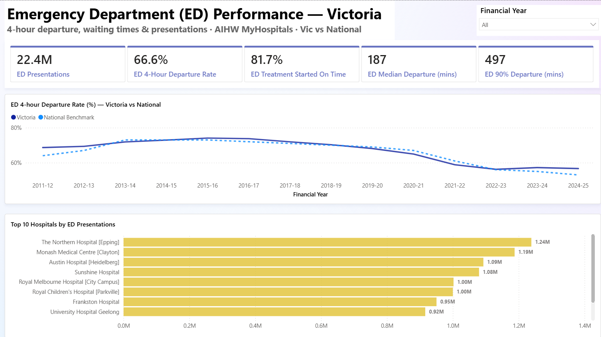
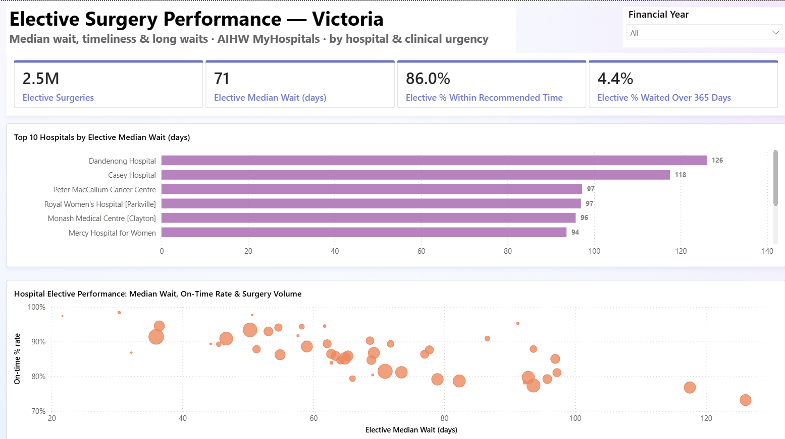
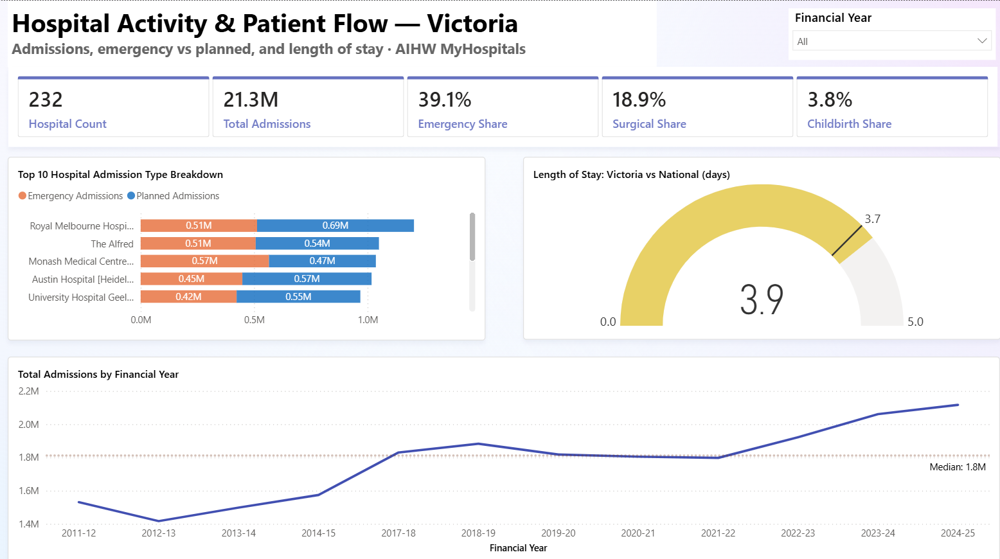

# health-analytics-fabric-project

> End-to-end Microsoft Fabric analytics — AIHW MyHospitals open REST API →
> Fabric Lakehouse medallion (Bronze → Silver → Gold) → PySpark star schema →
> Direct Lake Power BI 3-page dashboard. Focused Build 3 of Phil's
> data-engineering portfolio.

**Status: COMPLETE — shipped 2026-06-15.** End-to-end and interview-ready: AIHW MyHospitals REST API → Fabric Data Pipeline → Lakehouse Bronze (raw JSON snapshot) → PySpark Silver (Delta) → Gold Kimball star schema (1.7M-row fact + 4 dimensions) → Direct Lake semantic model + Import-mode Power BI 3-page dashboard. Full build history, design decisions and session log live in `PROJECT_CONTEXT.md`, with the per-component walkthroughs in `INGEST_PIPELINE.md`, `GOLD_NOTEBOOK.md` and `powerbi/SEMANTIC_MODEL.md`.

## What this project demonstrates

- **End-to-end in one platform** — pipeline, notebooks, Lakehouse, semantic model and report all live in a single Microsoft Fabric workspace on OneLake
- **Medallion lakehouse** — Bronze (raw JSON) → Silver (cleaned Delta) → Gold (dimensional model), each layer a distinct OneLake zone
- **REST ingestion via Fabric Data Pipeline** — a parameter-driven Copy activity lands 38 AIHW endpoints (5 list + 33 data-item measure codes) as raw JSON, courier-only with no transformation
- **PySpark transformation** — Silver notebook flattens nested JSON to Delta (1.7M fact rows) with an explicit schema for the large data-items read
- **Kimball star schema** — `fact_measure_value` + four conformed dimensions (hospital, measure, period, reported-measure) with deterministic surrogate keys
- **Direct Lake + Import** — a Direct Lake semantic model on Gold for the live platform story, plus a durable Import-mode `.pbix` that opens standalone after the trial capacity expires
- **22 documented DAX measures** — defined once in `powerbi/measures.tmdl` as the single source of truth, bulk-loaded via TMDL view
- **Real-world data-quirk handling** — AIHW publishes overlapping reported-measure groupings in one column (summing triple-counts); measures filter to a clean total or one MECE partition, and exclude suppressed values
- **3-page Power BI dashboard** (Import mode — opens standalone for reviewers)

## Architecture

```mermaid
flowchart LR
    A["AIHW MyHospitals REST API"] --> B["Fabric Data Pipeline (Copy)"]
    B --> C["Lakehouse BRONZE - raw JSON snapshot"]
    C --> D["PySpark notebook - flatten and conform"]
    D --> E["Lakehouse SILVER - Delta tables"]
    E --> F["PySpark notebook - star schema and tests"]
    F --> G["Lakehouse GOLD - fact and dimensions"]
    G --> H["Power BI - Direct Lake and Import - 3-page dashboard"]
```



## Stack

| Layer           | Choice                                                     |
| --------------- | ---------------------------------------------------------- |
| Source          | AIHW MyHospitals REST API (open, no auth, CC-BY)           |
| Ingestion       | Fabric Data Pipeline (Copy activity)                       |
| Storage         | Microsoft Fabric Lakehouse on OneLake (Delta)             |
| Transformation  | PySpark (Fabric notebooks)                                 |
| Modeling        | Kimball star schema — Bronze → Silver → Gold medallion     |
| Semantic model  | Direct Lake + Import-mode `.pbix`                          |
| BI              | Power BI Desktop                                           |
| Version control | Git + GitHub                                               |

## Project structure

```
health-analytics-fabric-project/
├── pipelines/                              # Fabric Data Pipeline definitions (exported JSON)
│   └── pl_ingest_myhospitals_bronze.json
├── notebooks/                              # PySpark notebooks (Silver + Gold)
│   ├── nb_silver_build.ipynb
│   └── nb_gold_build.ipynb
├── powerbi/                                # Power BI deliverables
│   ├── health_analytics_dashboard.pbix     # Import-mode dashboard (opens standalone)
│   ├── measures.tmdl                        # 22 DAX measures — single source of truth
│   ├── SEMANTIC_MODEL.md                    # star schema + measures documentation
│   └── screenshots/                         # dashboard page exports
├── docs/                                   # supporting docs / assets
├── README.md                               # this file
├── PROJECT_PLAN.md                         # locked scope, architecture rules, phases
├── PROJECT_CONTEXT.md                      # environment, identities, decision + session log
├── ENGINEERING_STANDARDS.md                # the quality bar every script meets
├── INGEST_PIPELINE.md                      # Bronze ingestion pipeline walkthrough
└── GOLD_NOTEBOOK.md                        # Gold star-schema notebook walkthrough
```

## How this project was built

This project was built using AI-assisted pair programming (Claude by Anthropic).
All architecture decisions, technology selections, and final design choices are
my own; the AI accelerated implementation and acted as a senior-DE code reviewer.
The intent of the project is portfolio learning — every component was built with
explicit understanding of what it does and why. The pipeline and notebook
walkthroughs are in `INGEST_PIPELINE.md` and `GOLD_NOTEBOOK.md`; design decisions
and session history are in `PROJECT_CONTEXT.md`, and the engineering bar each
script is held to is in `ENGINEERING_STANDARDS.md`.

## Project documents

- `PROJECT_PLAN.md` — locked scope, architecture rules, and phase breakdown
- `PROJECT_CONTEXT.md` — environment, identities, decision log and per-session history
- `ENGINEERING_STANDARDS.md` — the quality criteria every script is held to
- `INGEST_PIPELINE.md` — Bronze ingestion pipeline walkthrough
- `GOLD_NOTEBOOK.md` — Gold star-schema build notebook walkthrough
- `powerbi/SEMANTIC_MODEL.md` — semantic model, relationships and the 22 DAX measures

## Dashboard

Three pages built in Power BI Desktop on the Gold star schema. Import storage
mode — the `.pbix` opens standalone for reviewers. Live report:
`powerbi/health_analytics_dashboard.pbix`.

### ED Performance

[](powerbi/screenshots/01_ed_performance.png)

Emergency-department performance for Victoria. Five KPI cards (ED presentations,
4-hour departure rate, treatment started on time, median and 90th-percentile
departure times in minutes), a Victoria-vs-national 4-hour-departure-rate trend
since 2011-12, and a Top-10 hospitals by ED presentations bar.

### Elective Surgery

[](powerbi/screenshots/02_elective_surgery.png)

Elective-surgery waits and timeliness for Victoria. Four KPI cards (elective
surgeries, median wait in days, % within recommended time, % waited over 365
days), a Top-10 hospitals by median wait bar, and a wait-vs-on-time-rate scatter
with bubbles sized by surgery volume.

### Hospital Activity & Patient Flow

[](powerbi/screenshots/03_hospital_activity.png)

Admissions volume and case-mix for Victoria. Five KPI cards (hospital count,
total admissions, emergency / surgical / childbirth share), a Top-10 hospitals
emergency-vs-planned stacked bar, an average-length-of-stay gauge comparing
Victoria to the national hospital average, and a total-admissions trend with a
median reference line.

A note on the admissions data: AIHW publishes the same admissions under several
overlapping breakdowns in one field, so totals are taken from the explicit
"Total" reported measure (or a single mutually-exclusive partition) to avoid
double-counting. The emergency/planned care-type split is only reported for two
years, so it appears as a current-state split (cards, by hospital) rather than a
trend; length of stay has no national rollup, so the benchmark is the average
across all Australian hospitals.

## Related projects

Part of Phil's data-engineering portfolio — focused builds first, then full
end-to-end platforms:

- **Focused Build 1 — [operations-analytics-dbt-tableau-project](https://github.com/Pheluciam/operations-analytics-dbt-tableau-project)** — dbt testing + macros depth on a warehouse-distribution slice; PostgreSQL → dbt → Tableau.
- **Focused Build 2 — [analytics-tsql-adf-project](https://github.com/Pheluciam/analytics-tsql-adf-project)** — Jira REST → Azure Data Factory → Azure SQL → T-SQL star schema → Power BI.
- **Focused Build 3 — health-analytics-fabric-project** *(this one)* — Microsoft Fabric end-to-end: AIHW MyHospitals API → Lakehouse medallion → PySpark star schema → Power BI.
- **End-to-End Platform 1 — [cdc-nt-gtfs-project](https://github.com/Pheluciam/cdc-nt-gtfs-project)** — dbt-first pipeline on PostgreSQL → Power BI; Kimball modelling foundation.
- **End-to-End Platform 2 — [retail-demand-forecasting-project](https://github.com/Pheluciam/retail-demand-forecasting-project)** — Azure SQL → Snowflake → Airflow (Docker) → dbt → Power BI, with a Cortex forecast layer.
- **End-to-End Platform 3 — [financial-analytics-lakehouse-project](https://github.com/Pheluciam/financial-analytics-lakehouse-project)** — AWS-native lakehouse: S3 + Glue + Athena + Iceberg, dbt-athena, Step Functions, 6-page Power BI, keyless OIDC CI/CD.

## Author

Phil McKechnie — Business Intelligence Analyst & Developer, Melbourne. 15+ years
across operations, supply chain and analytics; the last 5 in dedicated BI roles
(SQL, Tableau, Power BI). Building a data-engineering portfolio across dbt, cloud
warehouses and AWS-native lakehouse work.

## Licence + attribution

Source data: Australian Institute of Health and Welfare (AIHW) MyHospitals API,
licensed CC-BY. This project is not affiliated with or endorsed by the AIHW.
